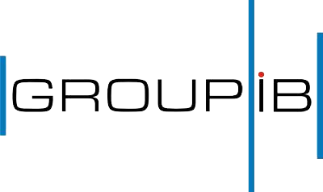
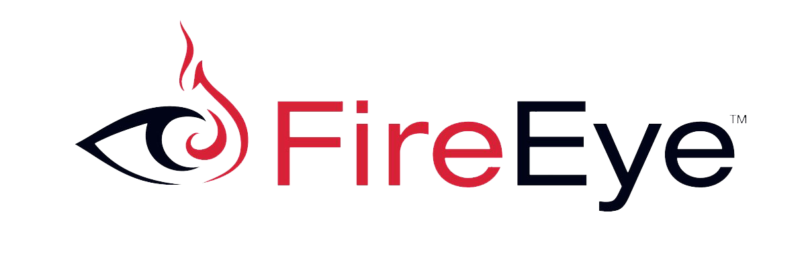
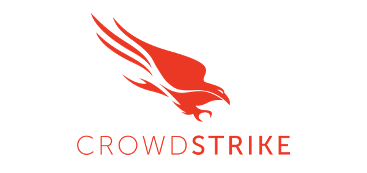
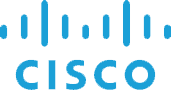
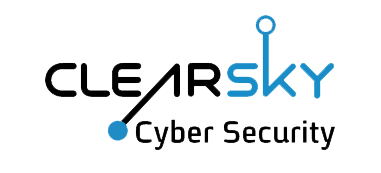

    

---

# Manual

整理、收集、安全世界的版图

- **注:下列排序不分先后高低**
- **注:下列排序不分先后高低**
- **注:下列排序不分先后高低**

* [企业](#企业)
    * [中国](#中国)
    * [俄罗斯](#俄罗斯)
    * [美国](#美国)
    * [以色列](#以色列)
    * [日本](#日本)
    * [韩国](#韩国)
    * [斯洛伐克](#斯洛伐克)
* [团队](#团队)
    * [国内团队](#国内团队)
    * [国外团队](#国外团队)
* [个人](#个人)
    * [国内博客](#国内博客)
    * [国外博客](#国外博客)
* [公众号-博客推荐](#公众号推荐)
    * [渗透测试 & 漏洞研究](#渗透测试-漏洞研究)
    * [电子取证](#电子取证)
    * [威胁情报](#威胁情报)
* [知识星球推荐](#知识星球推荐)
* [网站推荐](#网站推荐)
* [论坛推荐](#论坛推荐)
* [安全资源推荐](#安全资源推荐)

---

# 企业
## 中国

    

- **360**
    - **[追日团队 Helios Team](http://zhuiri.360.cn/index-eng.php)**

        从事APT攻击发现与追踪、互联网安全事件应急响应、黑客产业链挖掘和研究等工作。

    - **[独角兽团队 Unicorn Team](http://unicorn.360.cn/)**

        专注于无线安全，他们评估使用无线电技术各种系统的安全性，从RFID/NFC等小物件到GPS导航、无人机、智能汽车、移动通信和卫星通信等大型系统。

    - **鲲鹏安全团队 Roc Team**

        专注于硬件工具的研发，他们设计了许多攻击和防御类的硬件安全产品，以及会议硬件胸卡等。

    - **Pegasus Team**

        专注于WiFi系统的攻防，他们是360天巡无线入侵防御系统的原型设计者。

    - **[0KEE Team](https://0kee.360.cn)**

        致力于保护360公司全线业务的安全。
        从风险评估到安全审核，从日常监控到应急响应，从边界安全到业务安全，从生产网到办公网，大到体系架构，小到每一行代码... 这是我们的阵地。

    - **[涅槃团队 NirvanTeam](http://nirvan.360.cn)**

        一支专注于苹果系统安全研究和漏洞挖掘的团队

  

    

- **阿里巴巴**
    - **猎户座实验室**

        阿里安全猎户座实验室是以通用系统平台、软件供应链、终端和设备为研究对象，以提升攻防对抗能力方法论为目标的实验室。

  

    

- **安恒信息**
    - **AiLPHA大数据实验室**

        研究超大规模存查、大数据实时智能分析、用户行为（UEBA）分析、多维态势安全视图、企业安全联动闭环等技术

  

    

- **安胜**
    - **ISEC实验室**

        集公司优秀技术人才、资深网络安全专家全力打造的新技术及新产品预研基地，秉承“我的安全，我做主”的理念，提供技术和培训两大服务体系，包括网络安全培训、应急响应、安全检测等服务。

  

    

- **安天**
    - **[安天实验室](https://www.antiy.com/index.html)**

        提供端点防护、流量监测、深度分析、威胁情报和态势感知等相关产品、解决方案与服务。

  

    

- **國舜科技**
    - **毕加索实验室**

        持续关注漏洞发现、攻击识别、恶意挂马处理等基础安全技术。实验室构建了金融行业唯一一个“威胁资源库”，该资源库汇聚了六百多种金融机构可能面临的的威胁场景。

  

    

- **揆安网络科技**
    - **VSP**

        成员拥有CISP，RHCA、OSCP、CCIE等资质认证擅长于安卓系统、蓝牙交互、嵌入式linex的安全分析与检查。

  

    

- **[奇安信](https://www.qianxin.com/threat/threatenterprisenetwork)**
    - **观星实验室**

        主要的研究方向包括红队测试、应急响应与攻击溯源（DFIR）以及安全工具研发（ThreatHuting）方向，致力于为企业客户提供全方位专业的安全技术支持。

    - **天擎实验室 - Skylar Team**

    - **天堤网络安全实验室- SkyWall Team**

    - **天巡实验室**

        天巡实验室负责无线局域网攻防技术的探索与研究

    - **云影实验室**

        云影实验室，是奇安信专注于网络攻防研究的安全团队

    - **天眼实验室 - 红雨滴**

        奇安信旗下的高级威胁研究团队红雨滴（天眼实验室），成立于2015年，持续运营奇安信威胁情报中心至今，专注于APT攻击类高级威胁的研究，是国内首个发布并命名“海莲花”（APT-C-00，OceanLotus）APT攻击团伙的安全研究团队，也是当前奇安信威胁情报中心的主力威胁分析技术支持团队，具备0day漏洞发现能力。

  

    

- **启明星辰**
    - **ADLab**

        启明星辰积极防御实验室（ADLab）成立于1999年，是中国安全行业最早成立的攻防技术研究实验室之一，微软MAPP计划核心成员。截至目前，ADLab通过CVE发布Windows、Linux、Unix等操作系统安全或软件漏洞近300个，持续保持亚洲领先并确立了其在国际网络安全领域的核心地位。实验室研究方向涵盖操作系统与应用系统安全研究、移动智能终端安全研究、物联网智能设备安全研究、Web安全研究、工控系统安全研究、云安全研究。研究成果应用于产品核心技术研究、国家重点科技项目攻关、专业安全服务等。

  

    

- **四叶草安全**
    - **CloverSec**

      
    

        
    

- **[Tencent](https://slab.qq.com/labs.html)**
    - **[科恩实验室](https://keenlab.tencent.com/zh/)**

        实验室专注于国际范围内主流操作系统、互联网和移动互联网应用、云计算技术及物联网设备的前沿安全攻防技术研究。

    - **[玄武实验室](https://xlab.tencent.com/cn/)**

        发现影响整个条码阅读器行业二十年的严重安全漏洞，世界首次实现通过发射激光入侵系统。

    - **湛泸实验室**

        创新的实现了数据通道、利用SEH异常链表和DVE（数据虚拟执行）等漏洞攻防技术。

    - **云鼎实验室**

        关注腾讯云安全体系建设，专注于云上网络环境的攻防研究和安全运营，以及基于机器学习等前沿技术理念打造云安全产品。

    - **[反病毒实验室](https://tav.qq.com/)**

        自研的TAV杀毒引擎已获得国际七大著名第三方测评机构认证。实验室旗下的哈勃分析系统，可有效识别恶意样本。

    - **[移动安全实验室](https://yaq.qq.com/)**

        通过终端安全平台、网络安全平台和硬件安全平台为移动产业打造云管端全方位的安全解决方案。

  

    

- **天融信**
    - **[阿尔法实验室](http://blog.topsec.com.cn/)**

        0DAY漏洞挖掘及分析主要针对以下方向进行，WEB应用漏洞、安全产品漏洞、应用程序漏洞、操作系统漏洞、数据库漏洞、网络设备漏洞。

  

    

- **无糖信息**
    - **阿斯巴甜攻防实验室**

        无糖信息阿斯巴甜攻防实验室由国内知名安全团队PKAV于2017年组建，由PKAV核心精锐技术成员组成，致力于反网络犯罪领域的安全技术研究与产品研发，参与无糖信息反电话诈骗平台、反网络诈骗平台、反网络传销平台等反网络犯罪相关自动化实战平台的核心技术攻坚，同时为各地提供网络犯罪案件协查和技术攻坚支持，为国家及各省市相关执法部门在反网络犯罪领域做出了积极的贡献，获得公安部、各省、市公安机关的一致肯定及官方感谢。

  

    

- **知道创宇**
    - 404实验室

## 俄罗斯

    

- **[Kaspersky](https://securelist.com/)**

    全球研究与分析团队 (GReAT) 成立于 2008 年，是卡巴斯基实验室的核心运营团队，该团队发现了全球的 APT、网络间谍活动、主要恶意软件、勒索软件和地下网络罪犯发展趋势。如今 GReAT 由全球 40 多名专家组成，分布在俄罗斯、欧洲、美洲、亚洲和中东。

  

    

- **[Group-IB](https://www.group-ib.com/blog/)**

    Group-IB是预防和调查高科技犯罪和在线欺诈的全球领导者之一。自2003年以来，该公司一直活跃在计算机取证和信息安全领域，保护最大的国际公司免受经济损失和声誉风险。
    很多大型报告都出自他手，号称最熟悉俄罗斯本土APT组织的公司

## 美国

    

- **[FireEye](https://www.fireeye.com/blog/threat-research.html)**

    FireEye 作为安全界的神话之一，其在2012年后能够获得快速发展壮大，不仅恰逢当时全球网络安全环境需求新技术的大背景，以及新生领导力量的入驻，还包括美国军民融合模式对产业发展的巨大推动力。
    火眼披露的网络攻击涉及全球除美之外的所有国家和地区，百无禁忌。

  

    

- **[symantec](https://www.symantec.com/blogs/threat-intelligence)**

    一家提供安全产品和解决方案以保护中小型企业远离高级威胁、恶意软件和其他网络攻击。
    著名杀软诺顿便在他们公司旗下，总部美国，老牌杀毒厂商，实力没得说。

  

    

- **[Cylance](https://threatvector.cylance.com/en_us/category/research-and-intelligence.html)**

    Cylance是世界上第一家用人工智能，机器学习来维护网络安全的公司。它致力于帮助终端使用者，公司，政府解决最复杂的网络安全问题。Cylance通过探究黑客心理，研发出一套不同于传统黑名单白名单的一套复杂的数学模型与算法，从而提供了对于顶级网络威胁的防御办法。

  

    

- **[CrowdStrike](https://www.crowdstrike.com/blog/category/threat-intel-research/)**

    人工智能支持的虚拟安全平台CrowdStrike专注于终端保护和威胁检测智能，这家位于加州桑尼维尔的创企创立于2011年，它能帮助公司发现攻击即将到来时的征兆，并在漏洞出现前采取措施。CrowdStrike已经通过调查和汇报全世界不少知名的数据泄露事件为自己正名，公司在证明2016年俄罗斯入侵民主党全国委员会时起到了作用。同时它还表明2014年索尼影业被黑一事中，朝鲜可能是幕后者。

  

    

- **[Palo Alto](https://unit42.paloaltonetworks.com/)**

    Palo Alto Networks的安全平台融合了所有关键的网络安全功能，包括高级威胁保护、防火墙、IDS/IPS,以及URL过滤功能，保证与传统的防火墙、UTM或网络威胁检测产品相比拥有更佳的安全性。Palo Alto Networks 凭借深厚的专业知识、不断创新的理念以及革命性安全平台，赢得了数千家企业、政府和服务供应商的亲睐，成为市场上成长最快的网络安全公司。
    unit42团队是他们主要的网络战争研究团队，报告及时，分析严谨，关联准确，值得关注

  

    

- **[Cisco](https://blog.talosintelligence.com/)**

    思科Talos团队由业界领先的网络安全专家组成，他们分析评估黑客活动，入侵企图，恶意软件以及漏洞的最新趋势。包括ClamAV团队和一些标准的安全工具书的作者中最知名的安全专家，都是思科Talos的成员。该团队的专长涵盖软件开发，逆向工程，漏洞分析，恶意软件的调查和情报收集等。
    思科Talos作为思科安全情报的主要发掘提供团队,为思科的安全研究和安全产品服务提供了强大的后盾支持,帮助思科的安全解决方案阻挡最新最复杂的攻击。

## 以色列

    

- **[clearsky](https://www.clearskysec.com/blog/)**

    ClearSky网络安全提供网络解决方案，专注于威胁情报服务，主要面向金融部门，关键基础设施，公共部门和制药行业。主要针对中东地区攻击情况进行分析

  

    

- **[CheckPoint](https://research.checkpoint.com/)**

    Check Point软件技术有限公司，成立于1993年，总部位于以色列特拉维夫，全球首屈一指的 Internet 安全解决方案供应商。

## 日本

    

- **[trendmicro](https://blog.trendmicro.com/trendlabs-security-intelligence/)**

    趋势科技——网络安全软件及服务领域的全球领导者，以卓越的前瞻和技术革新能力引领了从桌面防毒到网络服务器和网关防毒的潮流，以独特的服务理念向业界证明了趋势科技的前瞻性和领导地位。总部位于日本东京和美国硅谷，旗下安全团队经验丰富。

## 韩国

    

- **[ESTsecurity](https://blog.alyac.co.kr/)**

    韩国第一大免费防毒软件ESTsecurity，专注韩国国内的APT攻击活动，只要是攻击韩国的活动他们都会出报告，非常nice的一家公司，出现朝鲜攻击韩国的活动会特别迅速的披露。

## 斯洛伐克

    

- **[ESET](https://www.welivesecurity.com/)**

    ESET是总部位于斯洛伐克布拉迪斯拉发的一家世界知名的电脑安全软件公司，创立于1992年，由两家私有公司合并而成，最知名的产品为NOD32防毒软件。
    ESET此前发布的报告，详细，精准，给众多报告提供了参考链接和素材。

---

# 团队
## 国内团队
- **[90sec](https://forum.90sec.com/)**
- **[chaMd5](http://www.chamd5.org)**
- **[红日](http://sec-redclub.com/index.php)**
- **[米斯特](https://www.hi-ourlife.com/)**
- **[破晓团队](http://www.secbug.org/)**
- **[网络尖刀](https://www.1aq.com/index.html)**
- **[nu1l](https://nu1l-ctf.com)**
- **[Symbo1](https://www.symbo1.com/)**

## 国外团队

---

# 个人
## 国内博客

## 国外博客

---

# 公众号-博客推荐
## 渗透测试-漏洞研究

## 电子取证

## 威胁情报
- **[御见威胁情报中心](https://s.tencent.com/research/report/)**

    腾讯御见威胁情报中心，是一个涵盖全球多维数据的情报分析、威胁预警分析平台。依托顶尖安全专家团队支撑，帮助安全分析人员快速、准确对可疑事件进行预警、溯源分析。

- **[微步情报局](https://x.threatbook.cn/nodev4/vb4/list)**

    微步在线，专注于威胁情报领域的专业公司，旗下情报社区会经常发布有质量的网络战争报告，用户名为微步情报局。

- **[安天CERT](https://www.antiy.cn/research/notice&report/research_report/index.html)**

    安天的CERT团队为公众提供重大恶意代码和安全事件的应急响应服务。在历史上，安天率先发现了红色代码II、口令蠕虫等恶意代码，对冲击波、魔波、震荡波、震网、火焰、Adrd、CarrierIQ等恶意代码或APT也提供了深度的分析报告和有效的应对方案。

- **[360 核心安全技术博客](http://blogs.360.cn/)**

    不定期发布网络战争类报告。

- **黑鸟**

    战略情报以及网络空间安全情报
    

        
    

- **奇安信威胁情报中心**

    奇安信旗下的高级威胁研究团队红雨滴（天眼实验室），成立于2015年，持续运营奇安信威胁情报中心至今，专注于APT攻击类高级威胁的研究，是国内首个发布并命名“海莲花”（APT-C-00，OceanLotus）APT攻击团伙的安全研究团队，也是当前奇安信威胁情报中心的主力威胁分析技术支持团队，具备0day漏洞发现能力。
    报告主要发布于其公众号
    

        
    

---

# 知识星球推荐

---

# 网站推荐

---

# 论坛推荐

---

# 安全资源推荐

---

`戒躁`